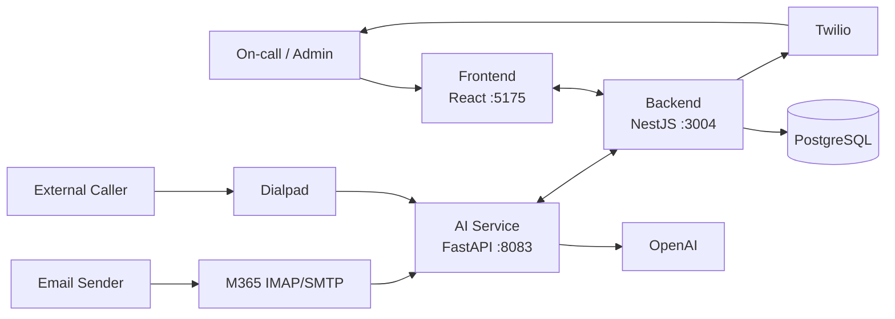

# HLD — After-Hours Escalation

**Flow:** email/voicemail → AI scores urgency → backend builds escalation ladder
from on-call rotation → Twilio calls + SMS until DTMF/SMS ack → status streams
to the live dashboard over WebSocket.

See [LLD.md](./LLD.md) for modules and schema.
