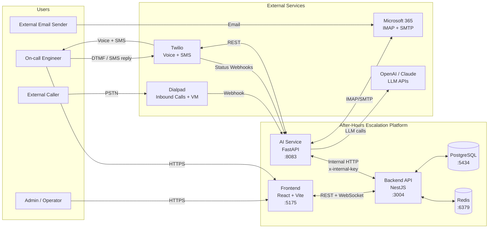
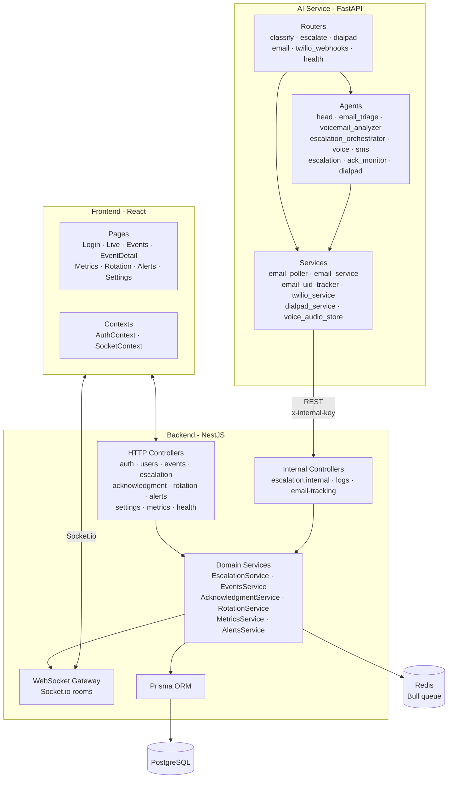
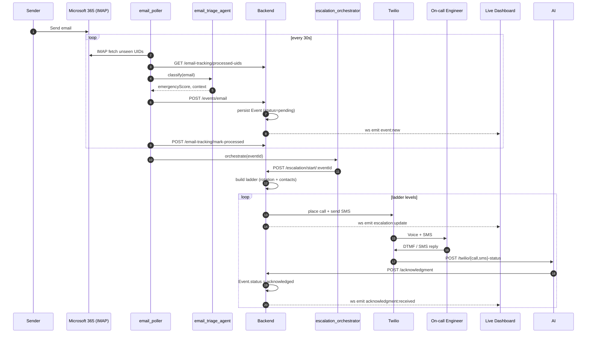
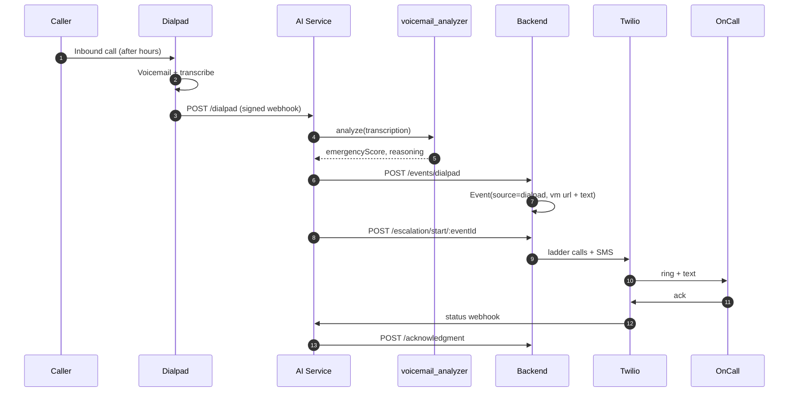
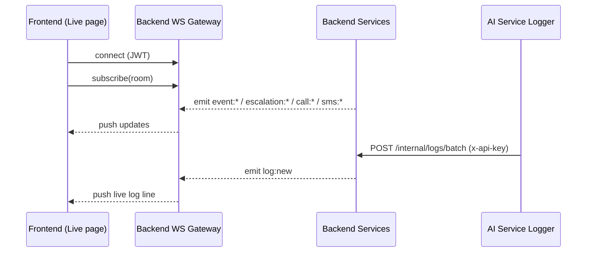
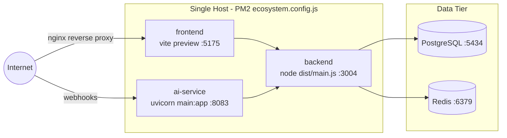

# High-Level Design — After-Hours Escalation System

This document describes the system at a component level: the major services, the
external integrations they talk to, and how data flows between them. For module-,
class-, and table-level detail see [LLD.md](./LLD.md).

## 1. System Context

## 2. Component Responsibilities

## 3. Primary Data Flows

### 3.1 Inbound Email → Escalation → Acknowledgment

### 3.2 Inbound Dialpad Call / Voicemail → Escalation

### 3.3 Live Dashboard Streaming

## 4. Deployment View

## 5. Cross-Cutting Concerns

| Concern         | Mechanism |
|-----------------|-----------|
| AuthN (UI)      | JWT (Passport `jwt` strategy), tokens in `localStorage` |
| AuthZ (UI)      | `RolesGuard` + `@Roles(...)` (admin / on_call / viewer) |
| AuthN (svc-svc) | `x-internal-key` / `INTERNAL_API_KEY` between AI service ↔ backend |
| Webhooks        | Twilio status callbacks, Dialpad signed JWT |
| Realtime        | Socket.io rooms emitted from domain services |
| Background work | Redis + Bull queue (escalation timers) |
| Process mgmt    | PM2 (`ecosystem.config.js`) |
| Observability   | Backend `/health`, `SystemHealthLog`, `AdminAlert`, log streaming to FE |
