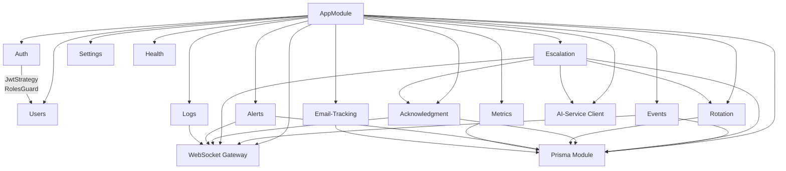
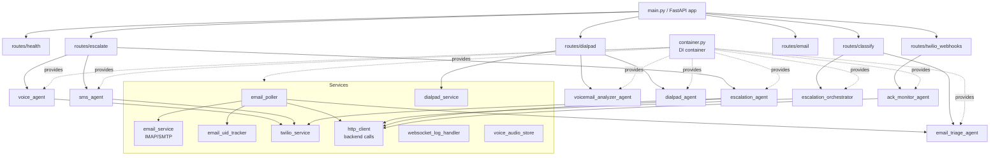
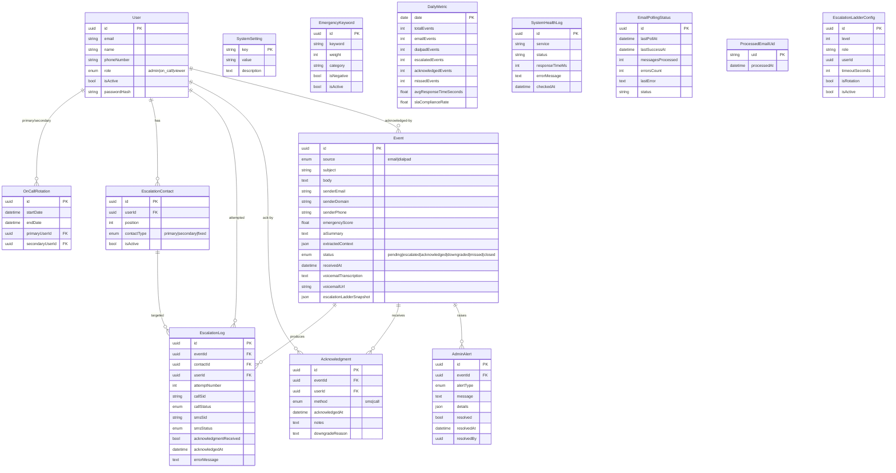
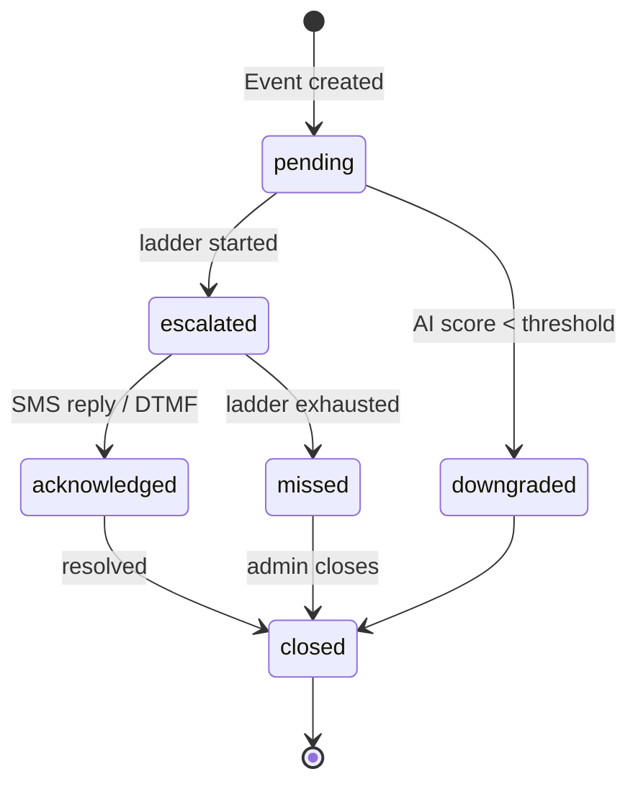
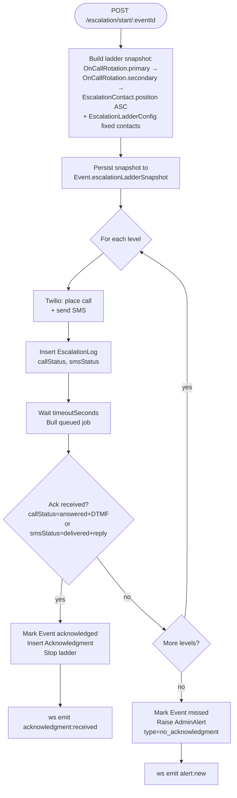
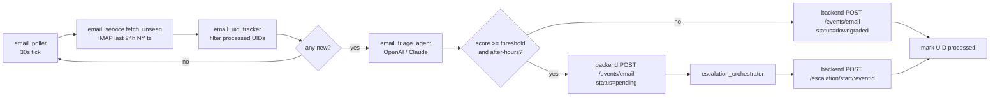
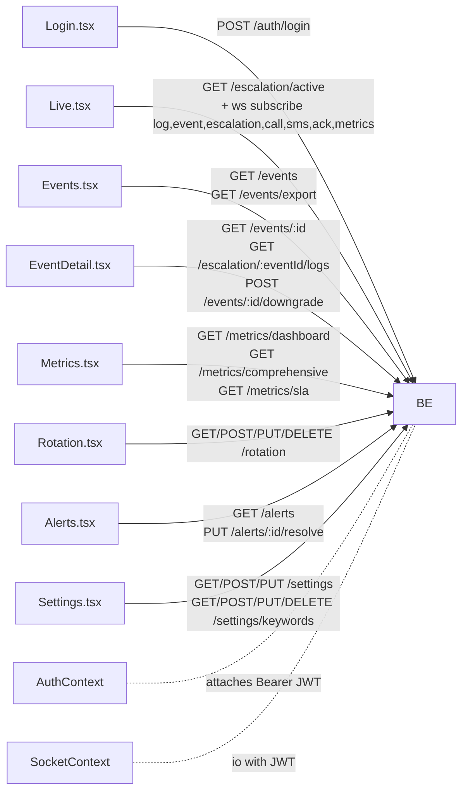
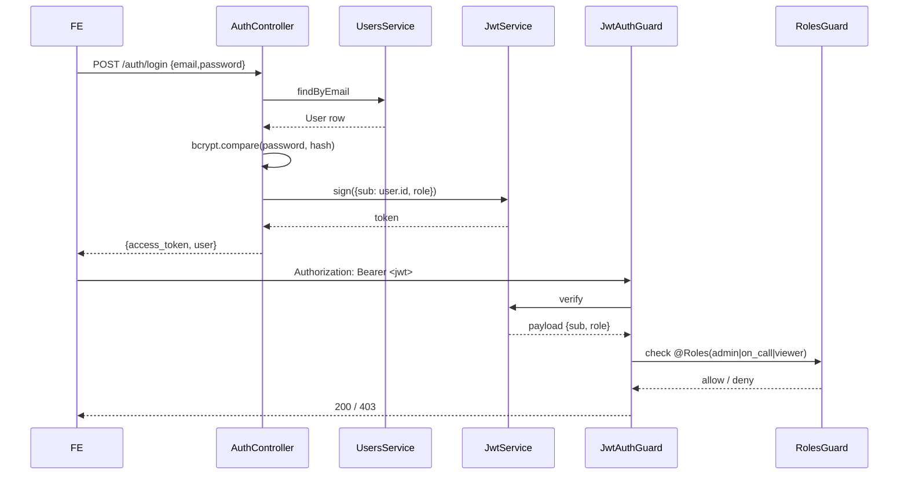
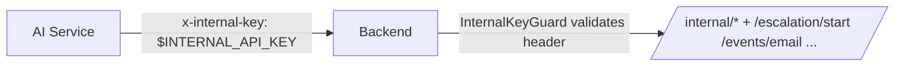

# Low-Level Design — After-Hours Escalation System

Module-, route-, and table-level detail. Pair with [HLD.md](./HLD.md) for the
component-level picture.

## 1. Backend (NestJS) Module Map

## 2. AI Service (FastAPI) Module Map

## 3. HTTP API Surface (selected)

| Service  | Method + Path                            | Purpose                                      | Auth         |
|----------|------------------------------------------|----------------------------------------------|--------------|
| Backend  | `POST /auth/login`                       | Issue JWT                                    | public       |
| Backend  | `GET  /auth/me`                          | Current user                                 | JWT          |
| Backend  | `GET  /events`                           | List events (filter, paginate)               | JWT          |
| Backend  | `POST /events/email`                     | AI service creates email event               | internal-key |
| Backend  | `POST /events/dialpad`                   | AI service creates Dialpad event             | internal-key |
| Backend  | `GET  /escalation/active`                | Active escalations                           | JWT          |
| Backend  | `POST /escalation/:eventId/start`        | Start ladder (manual)                        | JWT (admin)  |
| Backend  | `POST /escalation/start/:eventId`        | Start ladder (AI service)                    | internal-key |
| Backend  | `POST /escalation/call-status`           | Twilio call status relay                     | internal-key |
| Backend  | `POST /escalation/sms-status`            | Twilio SMS status relay                      | internal-key |
| Backend  | `POST /acknowledgments`                  | User-side ack                                | JWT          |
| Backend  | `POST /acknowledgment`                   | AI-service-side ack                          | internal-key |
| Backend  | `GET  /rotation/current`                 | Current on-call                              | JWT          |
| Backend  | `GET  /metrics/dashboard`                | KPIs                                         | JWT          |
| Backend  | `POST /internal/logs/batch`              | AI service log ingest                        | internal-key |
| AI svc   | `POST /classify/orchestrated`            | Multi-agent triage                           | internal-key |
| AI svc   | `POST /escalate/orchestrated`            | Run escalation ladder                        | internal-key |
| AI svc   | `POST /dialpad`                          | Dialpad webhook                              | signed JWT   |
| AI svc   | `POST /twilio/call-status`               | Twilio call webhook                          | Twilio sig   |
| AI svc   | `POST /twilio/sms-status`                | Twilio SMS webhook                           | Twilio sig   |

## 4. Database Schema (ERD)

## 5. Event State Machine

## 6. Escalation Ladder Algorithm

## 7. Email Ingestion Pipeline

## 8. Frontend Page → API Map

## 9. WebSocket Channels

| Event name              | Emitter                          | Consumer (page)            |
|-------------------------|----------------------------------|----------------------------|
| `log:new`               | `LogsController` (AI svc relay)  | Live                       |
| `event:new`             | `EventsService.create*`          | Live, Events               |
| `event:update`          | `EventsService.updateStatus`     | Live, Events, EventDetail  |
| `escalation:update`     | `EscalationService` (each level) | Live, EventDetail          |
| `call:update`           | `EscalationService` (Twilio cb)  | Live                       |
| `sms:update`            | `EscalationService` (Twilio cb)  | Live                       |
| `acknowledgment:received` | `AcknowledgmentService.create` | Live, EventDetail          |
| `alert:new`             | `AlertsService.create`           | Live, Alerts               |
| `health:update`         | `HealthService` periodic         | Live                       |
| `metrics:live`          | `MetricsService` periodic        | Live, Metrics              |

## 10. Auth & Authorization

## 11. Internal Service-to-Service Auth

## 12. File Pointers

| Concern                   | Path                                                            |
|---------------------------|-----------------------------------------------------------------|
| Backend bootstrap         | `backend/src/main.ts`                                           |
| Root module               | `backend/src/app.module.ts`                                     |
| JWT strategy              | `backend/src/auth/jwt.strategy.ts`                              |
| Internal API guard        | `backend/src/common/` (InternalKeyGuard)                        |
| Prisma schema             | `backend/prisma/schema.prisma`                                  |
| Escalation orchestration  | `backend/src/escalation/escalation.service.ts`                  |
| Internal escalation API   | `backend/src/escalation/escalation.internal.controller.ts`      |
| WebSocket gateway         | `backend/src/websocket/websocket.gateway.ts`                    |
| AI svc bootstrap          | `ai-service/main.py`                                            |
| DI container              | `ai-service/container.py`                                       |
| Email poller              | `ai-service/services/email_poller.py`                           |
| IMAP/SMTP                 | `ai-service/services/email_service.py`                          |
| Twilio integration        | `ai-service/services/twilio_service.py`                         |
| Dialpad webhook           | `ai-service/routes/dialpad.py`                                  |
| Triage agent              | `ai-service/ah_agents/email_triage_agent.py`                    |
| Orchestrator              | `ai-service/ah_agents/escalation_orchestrator.py`               |
| Frontend root             | `frontend/src/App.tsx`                                          |
| Auth context              | `frontend/src/contexts/AuthContext.tsx`                         |
| Socket context            | `frontend/src/contexts/SocketContext.tsx`                       |
| PM2 process config        | `ecosystem.config.js`                                           |
