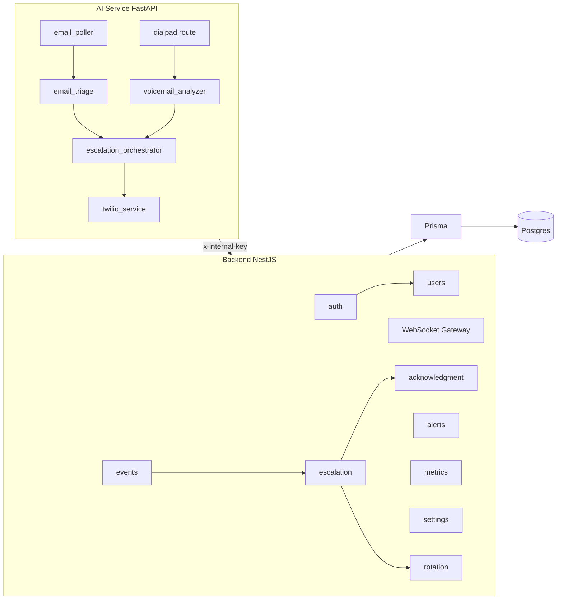
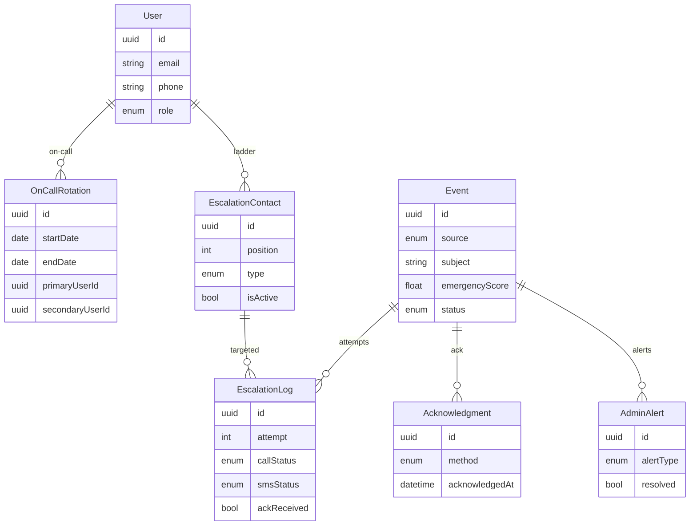
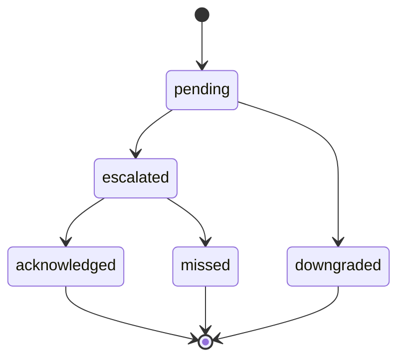

# LLD — After-Hours Escalation

## Modules

## Schema

## Event lifecycle

## Key files

| Concern             | Path                                                        |
|---------------------|-------------------------------------------------------------|
| Backend entry       | `backend/src/main.ts`                                       |
| Prisma schema       | `backend/prisma/schema.prisma`                              |
| Escalation logic    | `backend/src/escalation/escalation.service.ts`              |
| WebSocket gateway   | `backend/src/websocket/websocket.gateway.ts`                |
| AI entry            | `ai-service/main.py`                                        |
| Email poller        | `ai-service/services/email_poller.py`                       |
| Triage agent        | `ai-service/ah_agents/email_triage_agent.py`                |
| Orchestrator        | `ai-service/ah_agents/escalation_orchestrator.py`           |
| Twilio              | `ai-service/services/twilio_service.py`                     |
| Frontend root       | `frontend/src/App.tsx`                                      |
